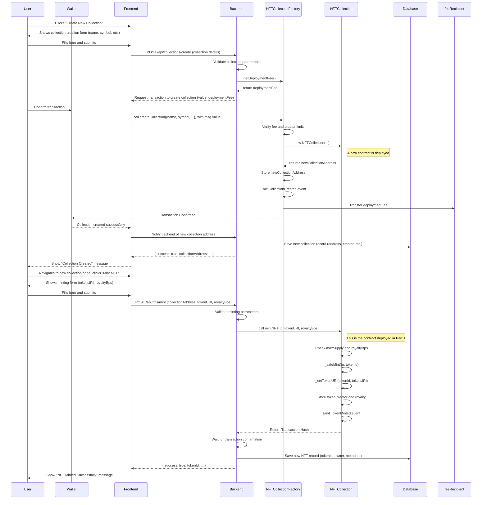
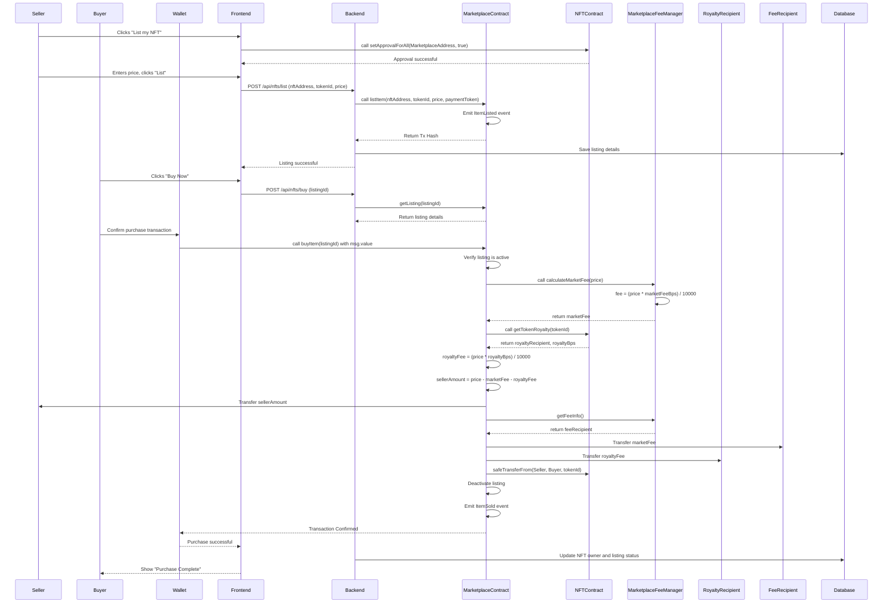
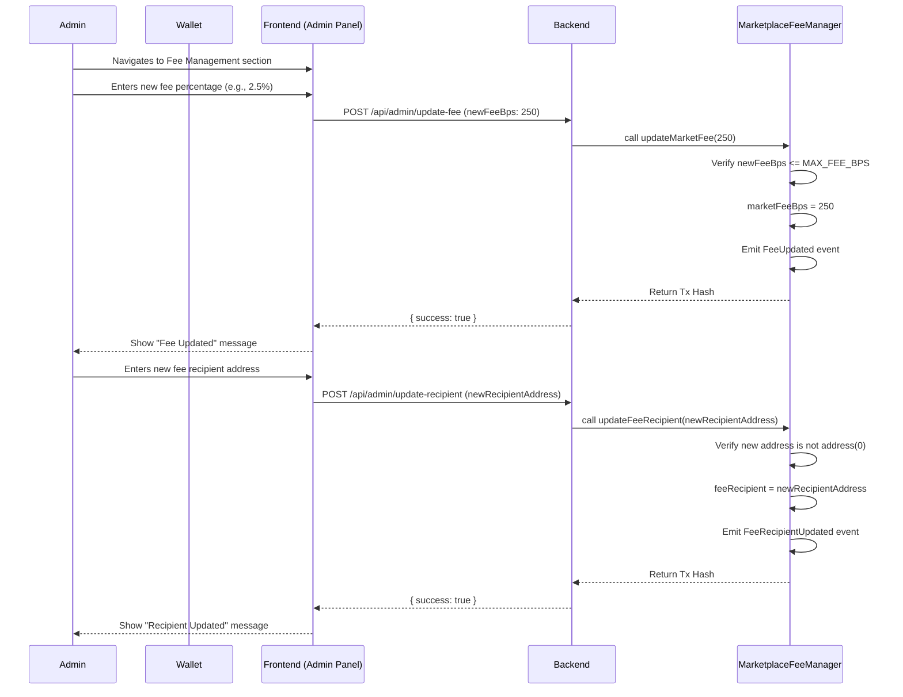

# NexArt Technical Documentation (v2)

This document provides a comprehensive technical overview of the NexArt NFT Marketplace, including its architecture, smart contract interactions, and detailed workflow diagrams.

## 1. Project Overview

### 1.1. Purpose and Goals

NexArt is a decentralized NFT (Non-Fungible Token) marketplace that allows users to mint, buy, and sell digital assets on the blockchain. The project consists of a backend server that communicates with a set of Ethereum-compatible smart contracts.

The primary goals of the project are:

- To provide a secure and reliable platform for NFT trading.
- To ensure low transaction fees and fast processing times.
- To offer a developer-friendly environment for building and extending the marketplace.

### 1.2. Backend and Smart Contract Interaction

The backend is built with Node.js and Express. It serves as an API for the frontend application, handling user requests and interacting with the smart contracts deployed on the blockchain. The backend uses the Ethers.js library to communicate with the Ethereum network.

The backend is responsible for:

- Fetching data from the smart contracts (e.g., NFT listings, user balances).
- Creating and signing transactions for state-changing operations (e.g., minting, buying, selling).
- Caching blockchain data to improve performance.
- Managing user accounts and authentication.

### 1.3. Supported Networks

The project is configured to support the following networks:

- **Local Development**: A local Hardhat network or Ganache instance for testing and development.
- **Testnets**: Configured for Sepolia testnet.
- **Mainnet**: Can be configured for Ethereum Mainnet or other EVM-compatible chains like Polygon, BNB Smart Chain, etc.

## 2. Architecture Overview

The project follows a layered architecture that separates concerns and promotes modularity.

### 2.1. Main Layers and Modules

- **`src/`**: The main application source code.
  - **`app.js`**: The entry point for the Express application, where middleware and routes are configured.
  - **`routes/`**: Defines the API endpoints and maps them to the appropriate controllers.
  - **`controllers/`**: (Not yet implemented) Handles incoming HTTP requests, validates input, and calls the appropriate services.
  - **`services/`**: (Not yet implemented) Contains the business logic and interacts with the blockchain and database.
  - **`helpers/`**: Utility functions used across the application.
- **`contracts/`**: The Solidity smart contracts that form the core of the marketplace.
- **`scripts/`**: Scripts for deploying and interacting with the smart contracts.
- **`test/`**: Test files for the smart contracts and backend.
- **`hardhat.config.ts`**: Configuration file for the Hardhat development environment.
- **`server.js`**: The main entry point of the backend server.

### 2.2. Architecture Diagram

```mermaid
flowchart TD
  A[Frontend (React/Next.js)] -->|HTTP Request| B[Backend API (Express)]
  B -->|Invoke| C[Controller Layer]
  C -->|Use| D[Service Layer]
  D -->|Call| E[Blockchain (Smart Contract via Ethers.js)]
  D -->|Save / Fetch| F[Database (MongoDB/MySQL)]
  E -->|Return Tx Receipt| D
  D -->|Format Response| C
  C -->|Send JSON| A
```

## 3. File-by-File Breakdown

### `server.js`

- **Purpose**: The main entry point for the Node.js server.
- **Main Functions**:
  - Imports the Express app from `src/app.js`.
  - Starts the server and listens for incoming connections on the configured port.
- **Dependencies**: `src/app.js`.

### `src/app.js`

- **Purpose**: Configures the Express application.
- **Main Functions**:
  - Initializes the Express app.
  - Sets up middleware for parsing JSON and URL-encoded data.
  - Mounts the main router from `src/routes`.
  - Implements a global error handling middleware.
- **Dependencies**: `express`, `dotenv`, `src/routes`.

### `src/routes/index.js`

- **Purpose**: The main router for the API.
- **Main Functions**:
  - Creates an Express router.
  - Delegates requests to sub-routers (e.g., `/test`).
- **Dependencies**: `express`, `./test`.

### `contracts/Marketplace.sol`

- **Purpose**: The core smart contract for the NFT marketplace.
- **Main Classes/Functions**:
  - `listItem`: Lists an NFT for sale.
  - `buyItem`: Buys a listed NFT.
  - `cancelListing`: Cancels an active listing.
  - `updateListingPrice`: Updates the price of a listing.
- **Dependencies**: `@openzeppelin/contracts`, `./MarketplaceFeeManager.sol`, `./NFTCollection.sol`.

### `hardhat.config.ts`

- **Purpose**: Configuration file for the Hardhat development environment.
- **Main Configuration**:
  - Specifies the Solidity compiler version.
  - Defines the network connections (localhost, Sepolia).
  - Configures Hardhat plugins.
- **Dependencies**: `hardhat`, `@nomicfoundation/hardhat-toolbox-mocha-ethers`, `@nomicfoundation/hardhat-network-helpers`.

## 4. Smart Contract Integration Details

### 4.1. Compilation and Deployment

The smart contracts are compiled using Hardhat. The `hardhat.config.ts` file is configured to use the Solidity `0.8.28` compiler.

Deployment is handled by scripts in the `scripts/` directory. The `scripts/deploy.ts` script (not yet implemented, but would be the standard) would use Ethers.js to deploy the `Marketplace` and other related contracts to the specified network.

### 4.2. Loading Contract ABI and Address

After deployment, Hardhat generates ABI files in the `artifacts/` directory. The backend can load these ABIs to interact with the deployed contracts.

The contract addresses are typically stored in a configuration file or environment variables after deployment. The backend would use the ABI and address to create a contract instance with Ethers.js:

```javascript
const { ethers } = require("ethers");
const marketplaceAbi =
  require("../artifacts/contracts/Marketplace.sol/Marketplace.json").abi;

const provider = new ethers.providers.JsonRpcProvider(process.env.RPC_URL);
const signer = new ethers.Wallet(process.env.PRIVATE_KEY, provider);

const marketplaceContract = new ethers.Contract(
  process.env.MARKETPLACE_CONTRACT_ADDRESS,
  marketplaceAbi,
  signer
);
```

### 4.3. Calling Contract Methods

- **Read Methods**: To call a read-only method, you can use the contract instance directly:
  ```javascript
  const listing = await marketplaceContract.getListing(listingId);
  ```
- **Write Methods**: To call a method that changes the state of the contract, you need to send a transaction:
  ```javascript
  const tx = await marketplaceContract.buyItem(listingId, { value: price });
  const receipt = await tx.wait();
  ```

### 4.4. Handling Gas Fees and Network Errors

Ethers.js automatically estimates gas fees for transactions. However, you can manually specify gas limits and prices if needed.

Network errors and transaction failures should be handled using `try...catch` blocks. The backend should be designed to be resilient to these errors and provide appropriate feedback to the user.

## 5. Full Smart Contract Workflow Diagrams

This section provides a comprehensive set of Mermaid sequence diagrams that illustrate the interactions between all smart contracts in the NexArt ecosystem.

### 5.1. Workflow: Create a New NFT Collection and Mint an NFT

This master workflow shows the end-to-end process starting from a user creating a new NFT collection via the factory, and then minting the first NFT into that collection.



### 5.2. Workflow: List, Buy, and Distribute Fees for an NFT

This diagram details the complete lifecycle of an NFT sale, from listing to purchase, including the crucial fee calculation and distribution steps involving the `MarketplaceFeeManager`.



### 5.3. Workflow: Admin Manages Marketplace Fees

This diagram shows how the contract owner can manage the fees and fee recipient for the entire marketplace.



## 6. Environment & Configuration

The following environment variables are required in a `.env` file:

- `PORT`: The port for the backend server.
- `RPC_URL`: The URL of the Ethereum JSON-RPC endpoint.
- `PRIVATE_KEY`: The private key of the account used to sign transactions.
- `MARKETPLACE_CONTRACT_ADDRESS`: The address of the deployed `Marketplace` contract.
- `NFT_COLLECTION_FACTORY_ADDRESS`: The address of the deployed `NFTCollectionFactory` contract.

These variables should be kept secure and not be committed to version control.

## 7. Run & Deployment Guide

### 7.1. Setup

1.  Clone the repository.
2.  Install dependencies:
    ```bash
    pnpm install
    ```
3.  Create a `.env` file and fill in the required environment variables.

### 7.2. Running the Backend

- **Development Mode**:
  ```bash
  pnpm dev
  ```
- **Production Mode**:
  ```bash
  pnpm start
  ```

### 7.3. Deploying Smart Contracts

1.  Configure the desired network in `hardhat.config.ts`.
2.  Run the deployment script:
    ```bash
    npx hardhat run scripts/deploy.ts --network <network-name>
    ```

### 7.4. Verifying Contracts

After deployment, you can verify the contracts on Etherscan (or a similar block explorer) using the Hardhat Etherscan plugin.

## 8. Complete Frontend Guide (Next.js & Wagmi)

This guide provides a comprehensive walkthrough for connecting a Next.js frontend to the NexArt smart contracts using the Wagmi library. It covers setup, configuration, and provides practical examples for every major function in the smart contract suite.

### 8.1. Setup and Configuration

First, set up your Next.js application and install the required dependencies.

```bash
npx create-next-app@latest my-nexart-frontend
cd my-nexart-frontend
pnpm add wagmi viem @tanstack/react-query
```

Next, configure the Wagmi client. Create a file `lib/wagmi.ts` and configure it with the desired chains and providers.

```typescript
// lib/wagmi.ts
import { http, createConfig } from "wagmi";
import { mainnet, sepolia } from "wagmi/chains";

export const config = createConfig({
  chains: [mainnet, sepolia],
  transports: {
    [mainnet.id]: http(),
    [sepolia.id]: http(),
  },
});
```

Wrap your application with the `WagmiProvider` in `pages/_app.tsx`.

```tsx
// pages/_app.tsx
import "@/styles/globals.css";
import type { AppProps } from "next/app";
import { WagmiProvider } from "wagmi";
import { QueryClient, QueryClientProvider } from "@tanstack/react-query";
import { config } from "../lib/wagmi";

const queryClient = new QueryClient();

export default function App({ Component, pageProps }: AppProps) {
  return (
    <WagmiProvider config={config}>
      <QueryClientProvider client={queryClient}>
        <Component {...pageProps} />
      </QueryClientProvider>
    </WagmiProvider>
  );
}
```

Finally, you'll need your contract ABIs and addresses. It's a good practice to store these in a central file. You should copy the ABI files from your `server/artifacts/contracts` directory into your frontend project.

```typescript
// lib/contracts.ts
import MarketplaceABI from "../path/to/artifacts/contracts/Marketplace.sol/Marketplace.json";
import NFTCollectionFactoryABI from "../path/to/artifacts/contracts/NFTCollectionFactory.sol/NFTCollectionFactory.json";
import NFTCollectionABI from "../path/to/artifacts/contracts/NFTCollection.sol/NFTCollection.json";
import MarketplaceFeeManagerABI from "../path/to/artifacts/contracts/MarketplaceFeeManager.sol/MarketplaceFeeManager.json";

export const marketplaceContract = {
  address: "0xYourMarketplaceAddress", // Replace with your deployed address
  abi: MarketplaceABI.abi,
} as const;

export const factoryContract = {
  address: "0xYourFactoryAddress", // Replace with your deployed address
  abi: NFTCollectionFactoryABI.abi,
} as const;

export const feeManagerContract = {
  address: "0xYourFeeManagerAddress", // Replace with your deployed address
  abi: MarketplaceFeeManagerABI.abi,
} as const;

// This ABI is used for interacting with any collection created by the factory
export const nftCollectionContract = {
  abi: NFTCollectionABI.abi,
} as const;
```

---

### 8.2. `MarketplaceContract` Interactions

This contract handles the core logic of listing, buying, and managing NFT sales.

#### Reading a Listing

Use `useReadContract` to fetch details of a specific listing.

```tsx
import { useReadContract } from "wagmi";
import { marketplaceContract } from "../lib/contracts";

function ListingDetails({ listingId }: { listingId: bigint }) {
  const {
    data: listing,
    isLoading,
    error,
  } = useReadContract({
    ...marketplaceContract,
    functionName: "getListing",
    args: [listingId],
  });

  if (isLoading) return <div>Loading listing...</div>;
  if (error) return <div>Error: {error.shortMessage}</div>;

  return (
    <div>
      <h3>NFT Address: {listing?.nftAddress}</h3>
      <p>Price: {listing?.price.toString()} wei</p>
      <p>Seller: {listing?.seller}</p>
    </div>
  );
}
```

#### Approving an NFT for Sale

Before listing, the seller must approve the Marketplace contract to transfer their NFT.

```tsx
import {
  useSimulateContract,
  useWriteContract,
  useWaitForTransactionReceipt,
} from "wagmi";
import { nftCollectionContract } from "../lib/contracts";
import { marketplaceContract } from "../lib/contracts";

function ApproveNFT({
  collectionAddress,
}: {
  collectionAddress: `0x${string}`;
}) {
  const { data: simulation } = useSimulateContract({
    address: collectionAddress,
    abi: nftCollectionContract.abi,
    functionName: "setApprovalForAll",
    args: [marketplaceContract.address, true],
  });

  const { data: hash, writeContract } = useWriteContract();
  const { isLoading, isSuccess } = useWaitForTransactionReceipt({ hash });

  return (
    <button
      onClick={() => writeContract(simulation!.request)}
      disabled={!simulation || isLoading}
    >
      {isLoading ? "Approving..." : "Approve Marketplace"}
    </button>
  );
}
```

#### Listing an NFT

After approval, the seller can list their NFT.

```tsx
import { useSimulateContract, useWriteContract } from "wagmi";
import { marketplaceContract } from "../lib/contracts";
import { parseEther } from "viem";

function ListItem({
  nftAddress,
  tokenId,
  price,
}: {
  nftAddress: `0x${string}`;
  tokenId: bigint;
  price: string;
}) {
  const { data: simulation } = useSimulateContract({
    ...marketplaceContract,
    functionName: "listItem",
    args: [
      nftAddress,
      tokenId,
      parseEther(price),
      "0x0000000000000000000000000000000000000000",
    ], // Assuming ETH payment
  });

  const { data: hash, writeContract } = useWriteContract();
  // ... useWaitForTransactionReceipt for feedback ...

  return (
    <button
      onClick={() => writeContract(simulation!.request)}
      disabled={!simulation}
    >
      List Item
    </button>
  );
}
```

#### Buying an NFT

A buyer can purchase a listed item.

```tsx
import { useSimulateContract, useWriteContract } from "wagmi";
import { marketplaceContract } from "../lib/contracts";

function BuyItem({ listingId, price }: { listingId: bigint; price: bigint }) {
  const { data: simulation } = useSimulateContract({
    ...marketplaceContract,
    functionName: "buyItem",
    args: [listingId],
    value: price,
  });

  const { data: hash, writeContract } = useWriteContract();
  // ... useWaitForTransactionReceipt for feedback ...

  return (
    <button
      onClick={() => writeContract(simulation!.request)}
      disabled={!simulation}
    >
      Buy Now
    </button>
  );
}
```

#### Canceling a Listing

The original seller can cancel their listing.

```tsx
import { useSimulateContract, useWriteContract } from "wagmi";
import { marketplaceContract } from "../lib/contracts";

function CancelListing({ listingId }: { listingId: bigint }) {
  const { data: simulation } = useSimulateContract({
    ...marketplaceContract,
    functionName: "cancelListing",
    args: [listingId],
  });

  const { data: hash, writeContract } = useWriteContract();
  // ... useWaitForTransactionReceipt for feedback ...

  return (
    <button
      onClick={() => writeContract(simulation!.request)}
      disabled={!simulation}
    >
      Cancel Listing
    </button>
  );
}
```

#### Updating a Listing Price

The seller can update the price of their listing.

```tsx
import { useSimulateContract, useWriteContract } from "wagmi";
import { marketplaceContract } from "../lib/contracts";
import { parseEther } from "viem";

function UpdateListingPrice({
  listingId,
  newPrice,
}: {
  listingId: bigint;
  newPrice: string;
}) {
  const { data: simulation } = useSimulateContract({
    ...marketplaceContract,
    functionName: "updateListingPrice",
    args: [listingId, parseEther(newPrice)],
  });

  const { data: hash, writeContract } = useWriteContract();
  // ... useWaitForTransactionReceipt for feedback ...

  return (
    <button
      onClick={() => writeContract(simulation!.request)}
      disabled={!simulation}
    >
      Update Price
    </button>
  );
}
```

---

### 8.3. `NFTCollectionFactory` Interactions

This factory contract is used to deploy new NFT collections.

#### Reading the Deployment Fee

Fetch the required fee to create a new collection.

```tsx
import { useReadContract } from "wagmi";
import { factoryContract } from "../lib/contracts";

function DeploymentFee() {
  const { data: fee } = useReadContract({
    ...factoryContract,
    functionName: "getDeploymentFee",
  });
  return <div>Deployment Fee: {fee?.toString()} wei</div>;
}
```

#### Creating a New Collection

Deploy a new `NFTCollection` contract.

```tsx
import { useSimulateContract, useWriteContract, useReadContract } from "wagmi";
import { factoryContract } from "../lib/contracts";

function CreateCollection() {
  const { data: fee } = useReadContract({
    ...factoryContract,
    functionName: "getDeploymentFee",
  });

  const { data: simulation } = useSimulateContract({
    ...factoryContract,
    functionName: "createCollection",
    args: ["My New Collection", "MNC", "https://my-base-uri.com/", 1000n],
    value: fee,
    enabled: fee !== undefined,
  });

  const { writeContract } = useWriteContract();
  return (
    <button
      onClick={() => writeContract(simulation!.request)}
      disabled={!simulation}
    >
      Create Collection
    </button>
  );
}
```

#### Reading a Creator's Collections

Fetch all collection addresses created by a specific user.

```tsx
import { useReadContract } from "wagmi";
import { factoryContract } from "../lib/contracts";

function CreatorCollections({
  creatorAddress,
}: {
  creatorAddress: `0x${string}`;
}) {
  const { data: collections } = useReadContract({
    ...factoryContract,
    functionName: "getCollectionsByCreator",
    args: [creatorAddress],
  });

  return (
    <ul>
      {collections?.map((addr) => (
        <li key={addr}>{addr}</li>
      ))}
    </ul>
  );
}
```

---

### 8.4. `NFTCollection` Interactions

This covers interactions with a specific, dynamically created NFT collection.

#### Minting an NFT

Mint a new token into a collection.

```tsx
import { useSimulateContract, useWriteContract } from "wagmi";
import { nftCollectionContract } from "../lib/contracts";

function MintNFT({
  collectionAddress,
  recipient,
}: {
  collectionAddress: `0x${string}`;
  recipient: `0x${string}`;
}) {
  const { data: simulation } = useSimulateContract({
    address: collectionAddress,
    abi: nftCollectionContract.abi,
    functionName: "mintNFT",
    args: [recipient, "https://my-token-uri.com/1.json", 500n], // to, tokenURI, royaltyBps (5%)
  });

  const { writeContract } = useWriteContract();
  return (
    <button
      onClick={() => writeContract(simulation!.request)}
      disabled={!simulation}
    >
      Mint NFT
    </button>
  );
}
```

#### Reading Token Royalty Info

Fetch the royalty details for a specific NFT.

```tsx
import { useReadContract } from "wagmi";
import { nftCollectionContract } from "../lib/contracts";

function TokenRoyalty({
  collectionAddress,
  tokenId,
}: {
  collectionAddress: `0x${string}`;
  tokenId: bigint;
}) {
  const { data: royaltyInfo } = useReadContract({
    address: collectionAddress,
    abi: nftCollectionContract.abi,
    functionName: "getTokenRoyalty",
    args: [tokenId],
  });

  return (
    <div>
      <p>Recipient: {royaltyInfo?.recipient}</p>
      <p>Royalty: {Number(royaltyInfo?.royaltyBps) / 100}%</p>
    </div>
  );
}
```

---

### 8.5. `MarketplaceFeeManager` Interactions (Admin)

These functions are typically restricted to the contract owner.

#### Reading Fee Info

Fetch the current marketplace fee configuration.

```tsx
import { useReadContract } from "wagmi";
import { feeManagerContract } from "../lib/contracts";

function FeeInfo() {
  const { data: feeInfo } = useReadContract({
    ...feeManagerContract,
    functionName: "getFeeInfo",
  });

  return (
    <div>
      <p>Fee Recipient: {feeInfo?.feeRecipient}</p>
      <p>Fee: {Number(feeInfo?.marketFeeBps) / 100}%</p>
    </div>
  );
}
```

#### Updating the Market Fee

Admin function to change the fee percentage.

```tsx
import { useSimulateContract, useWriteContract } from "wagmi";
import { feeManagerContract } from "../lib/contracts";

function UpdateMarketFee({ newFeeBps }: { newFeeBps: bigint }) {
  const { data: simulation } = useSimulateContract({
    ...feeManagerContract,
    functionName: "updateMarketFee",
    args: [newFeeBps],
  });

  const { writeContract } = useWriteContract();
  return (
    <button
      onClick={() => writeContract(simulation!.request)}
      disabled={!simulation}
    >
      Update Fee
    </button>
  );
}
```

#### Updating the Fee Recipient

Admin function to change the address that receives fees.

```tsx
import { useSimulateContract, useWriteContract } from "wagmi";
import { feeManagerContract } from "../lib/contracts";

function UpdateFeeRecipient({ newRecipient }: { newRecipient: `0x${string}` }) {
  const { data: simulation } = useSimulateContract({
    ...feeManagerContract,
    functionName: "updateFeeRecipient",
    args: [newRecipient],
  });

  const { writeContract } = useWriteContract();
  return (
    <button
      onClick={() => writeContract(simulation!.request)}
      disabled={!simulation}
    >
      Update Recipient
    </button>
  );
}
```
