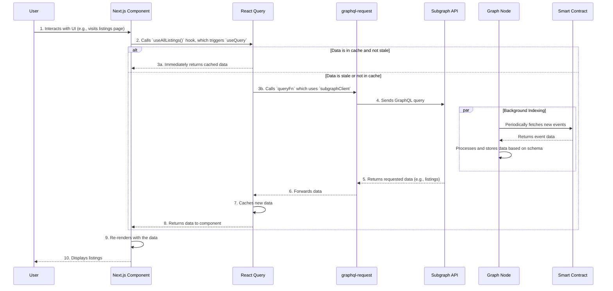

# 📘 Subgraph Documentation: NexArt Marketplace

This document provides a comprehensive guide for querying the NexArt Marketplace Subgraph from a Next.js frontend using **Next.js**, **React Query**, and **wagmi**.

## 1. Overview

### What is a Subgraph?

In the context of [The Graph Protocol](https://thegraph.com/), a **Subgraph** is a custom, open API that indexes blockchain data and makes it easily queryable using GraphQL. Blockchains themselves don't have a native query language, making it difficult to retrieve specific, filtered, or aggregated data. Subgraphs solve this by processing and storing blockchain events in a structured way, which can then be accessed efficiently.

### What is GraphQL?

[GraphQL](https://graphql.org/) is a query language for APIs and a runtime for fulfilling those queries with your existing data. Unlike traditional REST APIs, which expose a fixed set of endpoints, GraphQL allows clients to request exactly the data they need—nothing more, nothing less. This eliminates problems with over-fetching and under-fetching, leading to more efficient and predictable data retrieval.

### How Subgraphs Use GraphQL

A Subgraph defines a `schema.graphql` file, which specifies the types of data (entities) to be indexed from the blockchain. The Graph Node processes smart contract events, maps them to these entities, and stores them. The Subgraph then exposes a GraphQL endpoint that allows frontend applications to query these entities.

For example, instead of fetching all `ItemListed` events and filtering them client-side, you can directly ask the Subgraph for listings that meet specific criteria (e.g., price, seller, collection).

### 🚀 End-to-End Workflow

This sequence diagram illustrates the entire data flow, from a user interacting with the frontend to the Subgraph querying blockchain data.



## 2. Subgraph Schema and Entities

The `schema.graphql` file is the heart of the Subgraph. It defines the data structures (entities) that are tracked and how they relate to one another.

### Example `schema.graphql` Definitions

Our marketplace Subgraph tracks events related to listings, sales, and collections. Here are some key entities:

```graphql
# Represents a single NFT listing in the marketplace.
type ItemListed @entity(immutable: true) {
  id: Bytes! # Unique ID (transaction hash + log index)
  listingId: Bytes! # The on-chain listing ID
  seller: Bytes! # Address of the seller
  nftContract: Bytes! # Address of the NFT collection
  tokenId: BigInt! # Token ID of the NFT
  price: BigInt! # Listing price in the payment token
  paymentToken: Bytes! # Address of the ERC20 payment token
  blockTimestamp: BigInt! # Timestamp of the block
}

# Represents a completed sale.
type ItemSold @entity(immutable: true) {
  id: Bytes!
  listingId: Bytes!
  buyer: Bytes!
  seller: Bytes!
  nftContract: Bytes!
  tokenId: BigInt!
  price: BigInt!
  marketFee: BigInt!
  royaltyFee: BigInt!
  blockTimestamp: BigInt!
}

# Represents a newly created NFT collection via our factory.
type CollectionCreated @entity(immutable: true) {
  id: Bytes!
  collection: Bytes! # Address of the new collection contract
  creator: Bytes!
  name: String!
  symbol: String!
  maxSupply: BigInt!
  blockTimestamp: BigInt!
}
```

### Example Queries

#### Basic Query: Fetch Recent Listings

This query fetches the 10 most recent listings.

```graphql
query GetRecentListings {
  itemListeds(first: 10, orderBy: blockTimestamp, orderDirection: desc) {
    id
    listingId
    seller
    nftContract
    tokenId
    price
  }
}
```

#### Filtered Query: Fetch Listings by Seller

This query fetches all listings from a specific seller.

```graphql
query GetListingsBySeller($sellerAddress: Bytes!) {
  itemListeds(where: { seller: $sellerAddress }) {
    id
    nftContract
    tokenId
    price
  }
}
```

#### Paginated Query: Fetch Listings with Pagination

This query fetches the second page of 10 listings.

```graphql
query GetPaginatedListings {
  itemListeds(first: 10, skip: 10, orderBy: blockTimestamp, orderDirection: desc) {
    id
    price
  }
}
```

### Example GraphQL JSON Response

A response to the basic query above would look like this:

```json
{
  "data": {
    "itemListeds": [
      {
        "id": "0xabc...",
        "listingId": "0xdef...",
        "seller": "0x123...",
        "nftContract": "0x456...",
        "tokenId": "42",
        "price": "1000000000000000000"
      },
      {
        "id": "0xghi...",
        "listingId": "0xjkl...",
        "seller": "0x789...",
        "nftContract": "0xabc...",
        "tokenId": "101",
        "price": "500000000000000000"
      }
    ]
  }
}
```

## 3. Querying the Subgraph (Raw GraphQL)

You can test queries directly against the Subgraph's GraphQL endpoint using several tools.

### The Graph Playground

The easiest way to explore a Subgraph is through its hosted playground.

1.  Navigate to the Subgraph's URL on [The Graph Explorer](https://thegraph.com/explorer/).
2.  The playground provides an interactive editor with auto-completion and schema documentation.
3.  Paste your query and run it to see live results.

### cURL

You can send a raw GraphQL query using `cURL`.

```bash
curl -g -X POST \
  -H "Content-Type: application/json" \
  -d '{"query":"{ itemListeds(first: 5) { id seller price } }"}' \
  https://api.thegraph.com/subgraphs/name/your-username/your-subgraph-name
```

### Postman

1.  Create a new `POST` request.
2.  Set the URL to the Subgraph's HTTP endpoint.
3.  In the `Headers` tab, add `Content-Type: application/json`.
4.  In the `Body` tab, select `GraphQL`.
5.  Enter your query in the `Query` field. Postman will automatically format the request body.

## 4. Using in Next.js with React Query and `wagmi`

This stack provides a powerful and type-safe way to fetch blockchain data. **React Query** handles server state, caching, and re-fetching, while **`graphql-request`** acts as a minimal GraphQL client. **`wagmi`** provides the connected wallet context.

### Environment Variables

Store your Subgraph endpoint in an environment variable.

```.env.local
NEXT_PUBLIC_SUBGRAPH_URL=https://api.thegraph.com/subgraphs/name/your-username/your-subgraph-name
```

### Installation

```bash
pnpm install @tanstack/react-query graphql-request graphql wagmi viem
```

### Client Setup (`lib/subgraph-client.ts`)

Create a lightweight, reusable client instance with `graphql-request`.

```typescript
// lib/subgraph-client.ts
import { GraphQLClient } from 'graphql-request';

const endpoint = process.env.NEXT_PUBLIC_SUBGRAPH_URL;

if (!endpoint) {
  throw new Error("NEXT_PUBLIC_SUBGRAPH_URL is not set");
}

// This is NOT a React component/hook, but a simple client for making requests.
export const subgraphClient = new GraphQLClient(endpoint);
```

### Example Query (`graphql/queries/listings.ts`)

Define your GraphQL queries in a central location.

```typescript
// graphql/queries/listings.ts
export const GET_ALL_LISTINGS = `
  query GetAllListings($first: Int = 10, $skip: Int = 0) {
    itemListeds(
      first: $first
      skip: $skip
      orderBy: blockTimestamp
      orderDirection: desc
    ) {
      id
      listingId
      seller
      nftContract
      tokenId
      price
    }
  }
`;

export const GET_LISTINGS_BY_SELLER = `
  query GetListingsBySeller($seller: Bytes!) {
    itemListeds(where: { seller: $seller }, orderBy: blockTimestamp, orderDirection: desc) {
      id
      nftContract
      tokenId
      price
    }
  }
`;
```

### Custom Hook (`hooks/useListings.ts`)

Create custom hooks to encapsulate data-fetching logic. This makes your components cleaner and promotes reusability.

```typescript
// hooks/useListings.ts
import { useQuery } from '@tanstack/react-query';
import { subgraphClient } from '@/lib/subgraph-client';
import { GET_ALL_LISTINGS, GET_LISTINGS_BY_SELLER } from '@/graphql/queries/listings';
import { useAccount } from 'wagmi';

// Define a type for the expected response data
// For production, this should be auto-generated by GraphQL Code Generator
interface Listing {
  id: string;
  tokenId: string;
  price: string;
  seller: string;
  nftContract: string;
}

interface ListingsData {
  itemListeds: Listing[];
}

// Hook to fetch all listings
export const useAllListings = (variables: { first?: number; skip?: number }) => {
  return useQuery<ListingsData>({
    queryKey: ['allListings', variables],
    queryFn: async () => 
      subgraphClient.request(GET_ALL_LISTINGS, variables),
  });
};

// Hook to fetch listings for the connected user, using wagmi
export const useMyListings = () => {
  const { address, isConnected } = useAccount();

  return useQuery<ListingsData>({
    queryKey: ['myListings', address],
    queryFn: async () => {
      if (!address) return { itemListeds: [] };
      // Subgraph addresses are often lowercase, so it's a good practice to convert.
      return subgraphClient.request(GET_LISTINGS_BY_SELLER, { seller: address.toLowerCase() });
    },
    // Only run the query if the user is connected and has an address.
    enabled: isConnected && !!address,
  });
};
```

### Example Component (`app/listings/page.tsx`)

Your component consumes the hook and handles UI states. The `QueryClientProvider` should be set up in your root layout.

```typescript
// app/listings/page.tsx
'use client';

import { useAllListings, useMyListings } from '@/hooks/useListings';
import { useAccount } from 'wagmi';
import { formatEther } from 'viem';

function AllListings() {
  const { data, isLoading, isError, error } = useAllListings({ first: 20 });

  if (isLoading) return <p>Loading listings...</p>;
  if (isError) return <p>Error fetching listings: {error.message}</p>;

  return (
    <div>
      <h2>All Marketplace Listings</h2>
      <ul>
        {data?.itemListeds.map((listing) => (
          <li key={listing.id}>
            Token ID: {listing.tokenId} on contract {listing.nftContract} 
            for {formatEther(BigInt(listing.price))} ETH
          </li>
        ))}
      </ul>
    </div>
  );
}

function MyListings() {
    const { isConnected } = useAccount();
    const { data, isLoading, isError, error } = useMyListings();

    if (!isConnected) return <p>Please connect your wallet to see your listings.</p>;
    if (isLoading) return <p>Loading your listings...</p>;
    if (isError) return <p>Error fetching your listings: {error.message}</p>;

    return (
        <div>
            <h2>My Listings</h2>
            {data?.itemListeds.length === 0 ? (
                <p>You have no active listings.</p>
            ) : (
                <ul>
                    {data?.itemListeds.map((listing) => (
                      <li key={listing.id}>
                        Token ID: {listing.tokenId} for {formatEther(BigInt(listing.price))} ETH
                      </li>
                    ))}
                </ul>
            )}
        </div>
    )
}

export default function ListingsPage() {
  // Assuming QueryClientProvider and WagmiProvider are in a parent layout (e.g., app/layout.tsx)
  return (
    <div>
      <h1>Listings</h1>
      <MyListings />
      <AllListings />
    </div>
  );
}
```

## 5. Advanced Usage

### Filtering (`where`)

The `where` argument allows for powerful filtering.

```graphql
query FilteredListings {
  # Get listings with a price greater than 1 ETH
  itemListeds(where: { price_gt: "1000000000000000000" }) {
    id
    price
  }
}
```

### Sorting (`orderBy`)

Sort results using any top-level field on the entity.

```graphql
query SortedListings {
  # Get cheapest listings first
  itemListeds(orderBy: price, orderDirection: asc) {
    id
    price
  }
}
```

### Handling Multiple Networks

Use different environment variables for different networks.

```.env.local
# For production (e.g., Polygon Mainnet)
NEXT_PUBLIC_SUBGRAPH_URL_MAINNET=https://api.thegraph.com/subgraphs/name/.../mainnet
# For development (e.g., Mumbai Testnet)
NEXT_PUBLIC_SUBGRAPH_URL_MUMBAI=https://api.thegraph.com/subgraphs/name/.../mumbai
```

In your client setup, dynamically choose the endpoint:

```typescript
// lib/subgraph-client.ts
import { GraphQLClient } from 'graphql-request';

const getSubgraphUrl = () => {
    // This logic can be tied to your wagmi chain configuration
    const chainId = process.env.NEXT_PUBLIC_CHAIN_ID; 
    if (chainId === '137') { // Polygon Mainnet
        return process.env.NEXT_PUBLIC_SUBGRAPH_URL_MAINNET!;
    }
    // Default to Mumbai testnet for development
    return process.env.NEXT_PUBLIC_SUBGRAPH_URL_MUMBAI!;
}

const endpoint = getSubgraphUrl();

export const subgraphClient = new GraphQLClient(endpoint);
```

### ⚡ Caching and Performance with React Query

**React Query** is the core of our data-fetching strategy and is responsible for all caching.

-   **`staleTime`**: The duration (in ms) until stale data is re-fetched. Setting a `staleTime` of `5 * 60 * 1000` (5 minutes) means the data will be considered fresh for that duration, preventing unnecessary network requests on component re-mounts or window refocus.
-   **`cacheTime`**: The duration (in ms) that inactive query data is kept in the cache before being garbage collected. Defaults to 5 minutes.

```typescript
useQuery({
  queryKey: ['listings'],
  queryFn: fetchListings,
  staleTime: 1000 * 60 * 5, // 5 minutes
});
```

## 6. Common Patterns & Best Practices

### 📁 GraphQL Folder Structure

Organize your GraphQL files for maintainability.

```
graphql/
├── fragments/
│   └── ListingFragment.ts
├── mutations/
│   └── CreateOffer.ts
└── queries/
    └── GetListings.ts
```

### GraphQL Code Generator

[GraphQL Code Generator](https://www.graphql-code-generator.com/) is a powerful tool that generates TypeScript types directly from your GraphQL schema and queries. This provides end-to-end type safety.

-   **Benefits:** Auto-generates types for query results, variables, and even typed React Query hooks.
-   **Setup:** Requires a `codegen.yml` configuration file and a script in `package.json`.

### Error Handling and Loading States

Always handle loading and error states gracefully in your UI to provide a good user experience. Skeletons, spinners, and toast notifications are common patterns. React Query's `isLoading` and `isError` flags make this straightforward.

### Data Normalization

-   **Prices/Numbers:** Subgraphs return large numbers as strings. Always parse them into a safe number format like `BigInt` before performing calculations. The example uses `formatEther` from `viem` for display.
-   **Addresses:** Addresses are returned as lowercase byte strings. Ensure consistent casing if you are comparing them (e.g., by using `getAddress` from `viem`).

### Naming Conventions

-   **Queries:** Use descriptive names like `GetListingsByCollection` or `GetUserProfile`.
-   **React Query Keys:** Use structured query keys to manage the cache effectively. This allows for granular invalidation. Good: `['listings', { collection: '0x123', page: 2 }]`. Bad: `['listings']`.
